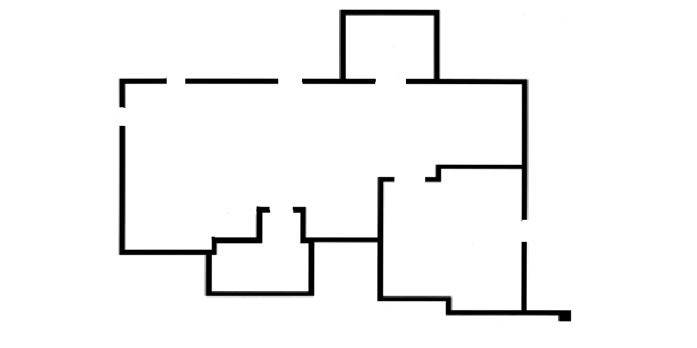
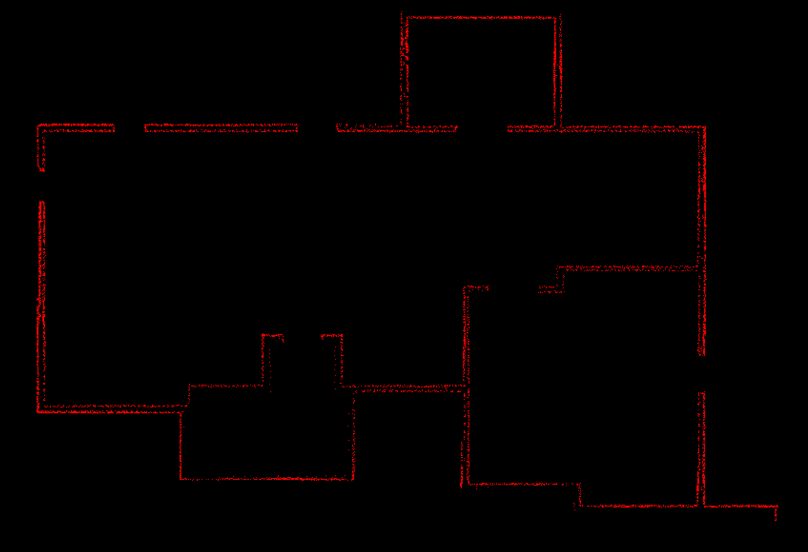

# Mapping
Mapping is the goal for an autonomous robot to be able to create a floor plan of its surrounding environment. Later to be used for localization.

## Lidar
Laser imaging, detection and ranging. It uses light as a measurement of surrounding objects by measuring the amount of time it takes for the light to return to the receiver. Lidar is used to make high resolution maps.

## Autonomous Vehicles
Autonomous vehicles use versions of lidar that uses lasers in vertical orientation then adding spin in the horizontal plane to get a 360 degree mapping of the surrounding. Lidar is often paired with data from other sensors to get a more accurate understanding of the surrounding. Lidar is perform well under poor low lighting conditions. Lidar does not perform well under rain. Lidar mapping the surrounding environment requires processing massive amounts of data.

## Operation
Mouse click and hold to turn on lidar. Dragging mouse to move lidar. Mouse release to turn off lidar.

## Pictures
Original image of the environment\
\
Point map of lidar data\

